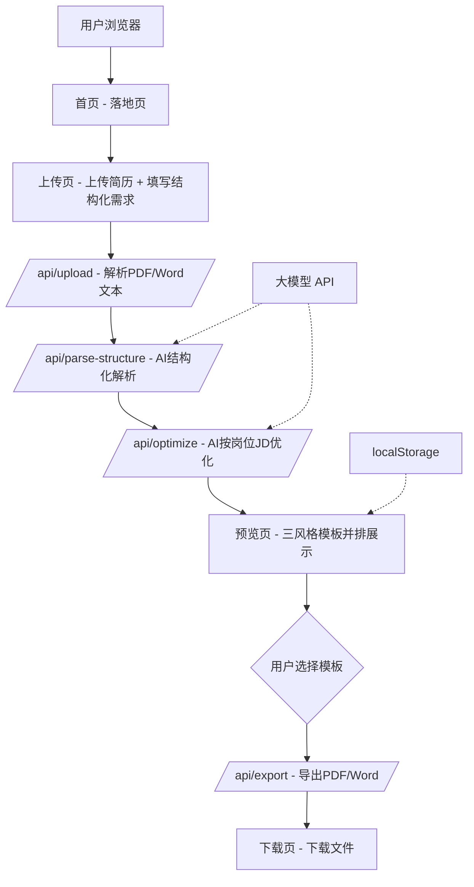

## 产品概述

一款基于 AI 的简历优化与生成工具。用户上传现有简历（PDF/Word），填写结构化改写需求（目标岗位JD、期望语气、重点突出方向等），AI 自动将简历内容结构化解析后进行专业化优化（精简/扩写/改写），并一次性生成极简风、科技风、精美风三个模板供用户挑选，最终导出为 PDF 或 Word 文件。

## 核心功能

- 上传 PDF/Word 简历，服务端解析提取文本
- 填写结构化改写需求表单：目标岗位JD、期望语气（专业/活泼/沉稳）、重点突出（业绩/技能/项目）、其他要求
- AI 结构化解析：将非结构化简历文本转为标准 Resume 数据结构
- AI 智能优化内容：基于目标岗位JD，内容少则扩写、内容多则精简，并做专业化改写
- 自动生成三个不同风格（极简/科技/精美）的简历模板预览，用户无需单独选风格
- 用户选择模板后一键导出 PDF/Word
- 隐私安全：简历数据不落库，内存临时处理后销毁
- 轻量会话持久化：localStorage 缓存优化结果，刷新不丢失

## 技术栈

- 全栈框架：Next.js 14+（App Router）+ TypeScript
- 样式：Tailwind CSS
- 组件库：shadcn/ui
- AI 能力：OpenAI / DeepSeek / Claude API（通过环境变量配置，支持切换）
- 文件解析：pdf-parse（PDF）、mammoth.js（Word）
- 导出：@react-pdf/renderer（PDF）、docx（Word）
- 状态管理：Zustand + persist 中间件（localStorage 持久化）
- 校验：Zod（AI 返回结果结构化校验）
- 限流：基于 IP 的内存 rate-limit（MVP 简单实现）
- 图标：lucide-react

## 实现思路

采用 Next.js 全栈方案。核心流程分为四阶段：**上传解析 → AI 结构化 → AI 优化 → 模板渲染与导出**。

关键决策与理由：

1. **取消独立风格选择页**：AI 基于简历内容与目标岗位智能推荐并直接生成3个不同风格模板，减少用户操作步骤，预览页一次性展示三种风格供挑选。
2. **增加 AI 结构化解析步骤**：用户上传的简历格式各异，纯文本无法直接优化。先通过 AI 将文本解析为标准 `Resume` 结构（基本信息/教育/工作/项目/技能/自我评价），再交给优化环节，确保优化质量与数据可控。
3. **改写需求结构化表单**：目标岗位JD + 期望语气 + 重点突出方向 + 其他要求，降低用户思考成本，提升 AI 优化针对性。
4. **模板用预制 React 组件**：AI 专注内容优化，模板布局由预制高质量组件控制，确保"顶级设计"标准可控可验收。
5. **三模板共用同一份优化后结构化数据**：仅通过不同组件渲染出不同视觉风格，避免重复优化。

性能与可靠性：

- AI 调用增加超时（30s）、重试（1次）和错误降级（返回原文并提示用户）
- 文件解析在服务端内存中处理，不落盘不落库
- 限流：每 IP 每小时最多 10 次优化请求，防止接口滥用
- 对 AI 返回结果用 Zod 做结构化校验，字段缺失时降级处理

## 关键执行要点

- 上传文件在服务端解析后立即从内存释放，不写入磁盘，不持久化
- AI 结构化解析 prompt 要求模型返回 JSON，用 Zod schema 校验，不通过时重试一次
- AI 优化 prompt 注入目标岗位JD，让模型按岗位关键词重写，突出匹配度
- 模板组件使用打印友好 CSS：A4 尺寸（210mm x 297mm）、分页控制（page-break-inside: avoid）、字号/间距/留白规范统一
- 环境变量中配置 API Key，禁止在前端暴露密钥
- localStorage 仅缓存 session ID 和优化后的结构化数据（不含原始文件），7天过期
- 上传页置顶隐私声明："您的简历仅在本次处理中使用，处理完成后即销毁，不会被存储或用于其他用途"

## 架构设计



## 目录结构

```
ai-resume/
├── app/
│   ├── page.tsx                          # [NEW] 首页落地页，Hero强调"AI按目标岗位JD优化"
│   ├── upload/
│   │   └── page.tsx                      # [NEW] 上传简历 + 结构化改写需求表单（目标JD/语气/重点/其他）+ 隐私声明
│   ├── preview/
│   │   └── page.tsx                      # [NEW] 三风格模板并排预览，选中高亮，支持缩放
│   ├── download/
│   │   └── page.tsx                      # [NEW] 下载页，PDF/Word按钮，重新生成入口
│   ├── api/
│   │   ├── upload/
│   │   │   └── route.ts                  # [NEW] 接收PDF/Word文件，解析为纯文本，含IP限流
│   │   ├── parse-structure/
│   │   │   └── route.ts                  # [NEW] AI将文本解析为标准Resume结构，Zod校验
│   │   ├── optimize/
│   │   │   └── route.ts                  # [NEW] AI按目标JD优化内容（精简/扩写/改写），Zod校验
│   │   └── export/
│   │       └── route.ts                  # [NEW] 根据选中模板+优化数据导出PDF/Word
│   ├── layout.tsx                        # [NEW] 根布局
│   └── globals.css                       # [NEW] 全局样式 + 打印友好CSS
├── components/
│   ├── ui/                               # [NEW] shadcn/ui 组件
│   ├── resume/
│   │   ├── MinimalistTemplate.tsx        # [NEW] 极简风模板 - 单栏、大量留白、黑白灰
│   │   ├── TechTemplate.tsx              # [NEW] 科技风模板 - 双栏、深色侧边栏、蓝色强调
│   │   └── ElegantTemplate.tsx           # [NEW] 精美风模板 - 顶部色带、衬线标题、精致间距
│   ├── upload/
│   │   ├── FileDropzone.tsx              # [NEW] 拖拽上传区，支持PDF/Word
│   │   └── OptimizeForm.tsx              # [NEW] 结构化改写需求表单
│   ├── preview/
│   │   └── TemplateGallery.tsx           # [NEW] 三模板并排展示与选择
│   └── download/
│       └── DownloadPanel.tsx             # [NEW] 下载按钮与格式选择
├── lib/
│   ├── ai/
│   │   ├── client.ts                     # [NEW] AI客户端封装，超时/重试/降级
│   │   ├── prompts.ts                    # [NEW] 结构化解析prompt + 优化prompt
│   │   └── schemas.ts                    # [NEW] Zod schema定义（Resume结构校验）
│   ├── parser/
│   │   ├── pdf.ts                        # [NEW] PDF解析（pdf-parse）
│   │   └── docx.ts                       # [NEW] Word解析（mammoth.js）
│   ├── templates/
│   │   ├── index.ts                      # [NEW] 模板注册表，映射风格到组件
│   │   └── spec.ts                       # [NEW] 模板设计规范（A4尺寸/字号/间距/分页规则）
│   ├── export/
│   │   ├── pdf.ts                        # [NEW] PDF导出（@react-pdf/renderer）
│   │   └── docx.ts                       # [NEW] Word导出（docx库）
│   ├── middleware/
│   │   └── rate-limit.ts                 # [NEW] 基于IP的内存限流
│   └── store/
│       └── resume-store.ts               # [NEW] Zustand store + localStorage持久化
├── types/
│   └── resume.ts                         # [NEW] Resume类型定义（基本信息/教育/工作/项目/技能/自我评价）
├── public/
│   └── fonts/                            # [NEW] 自定义字体
├── .env.example                          # [NEW] 环境变量示例（AI_API_KEY, AI_MODEL, AI_BASE_URL）
├── next.config.js                        # [NEW] Next.js配置
├── tailwind.config.ts                    # [NEW] Tailwind配置
├── package.json                          # [NEW]
└── README.md                             # [MODIFY] 项目说明
```

## 设计风格

采用高端玻璃拟态（Glassmorphism）结合现代渐变风格，营造专业、可信赖且富有科技感的视觉体验。首页 Hero 区以深色渐变开场，强调"AI 按目标岗位 JD 优化"差异化卖点，配合悬浮卡片、微光动效和细腻过渡动画。整体配色以深蓝紫为主调，突出专业感与科技感。

## 页面规划（4页，取消原风格选择页）

1. **首页**：全屏 Hero（"AI 按目标岗位 JD 优化"大标题）、核心卖点三步流程、风格示例缩略图、开始按钮
2. **上传页**：顶部隐私声明、拖拽上传区、文件类型提示、结构化改写需求表单（目标岗位JD文本框、期望语气选择、重点突出多选、其他要求）、提交按钮
3. **预览页**：三模板（极简/科技/精美）并排 A4 比例展示，每个模板标注风格名称，选中后边框高亮，支持点击缩放大图查看，底部确认按钮
4. **下载页**：选中模板的大图展示、PDF/Word 格式选择按钮、重新生成入口

## 页面分块设计

- 顶部导航：透明背景，滚动后毛玻璃效果，Logo + 开始/继续按钮
- Hero 区：深色渐变背景 + 光晕粒子动效，大标题"AI 按目标岗位 JD 优化你的简历"，副标题，CTA 按钮
- 流程卡片：三列卡片展示"上传-优化-导出"，带悬停上浮动效
- 隐私声明条：上传页顶部，浅色背景，盾牌图标，一句话隐私承诺
- 上传区：虚线边框拖拽区，支持点击选择，文件类型与大小限制提示
- 需求表单：卡片式布局，目标JD为大文本框，语气为按钮组，重点突出为多选标签，其他要求为可选文本框
- 模板预览：三列等宽，每个为 A4 比例缩略图，底部风格标签，选中时蓝色边框 + 勾选图标
- 底部导航：简洁版权信息、帮助链接

## 计划使用的扩展能力

### Skill

- **pdf**
- 用途：解析用户上传的 PDF 简历内容提取文本，并生成最终 PDF 导出文件
- 预期效果：完成 PDF 文件上传解析与下载导出，确保文本提取完整、导出排版正确
- **docx**
- 用途：解析用户上传的 Word 简历内容提取文本，并生成最终 Word 导出文件
- 预期效果：完成 Word 文件上传解析与下载导出，确保格式转换准确
- **agent-browser**
- 用途：对完整的上传-填写需求-预览三模板-选择-下载流程进行端到端浏览器测试
- 预期效果：验证核心用户路径可正常跑通，无报错无阻塞