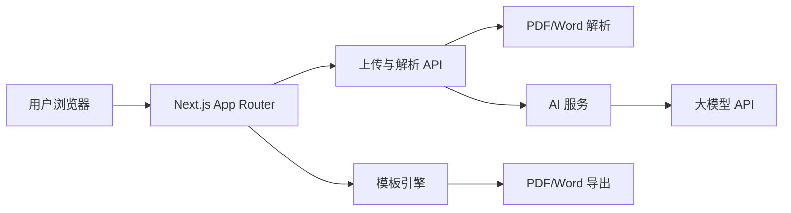

<<plan_result>
<<req>

## 产品概述

一款基于 AI 的简历优化与生成工具。用户上传现有简历（PDF/Word），输入改写需求，选择心仪风格，AI 自动优化内容并生成三个精美模板供挑选，最终导出为 PDF 或 Word 文件。

## 核心功能

- 上传 PDF/Word 简历并解析文本
- 输入改写需求（岗位、风格、重点等）
- 选择简历风格：极简风、科技风、精美风等
- AI 智能优化内容：内容少则扩写，内容多则精简，并做专业化改写
- 生成三个不同布局的简历模板预览
- 用户选择模板后导出 PDF/Word
</req>

<<tech>

## 技术栈

- 全栈框架：Next.js 14+（App Router）+ TypeScript
- 样式：Tailwind CSS
- 组件库：shadcn/ui
- AI 能力：OpenAI / DeepSeek / Claude API（通过环境变量配置）
- 文件解析：pdf-parse（PDF）、mammoth.js（Word）
- 导出：@react-pdf/renderer（PDF）、docx（Word）
- 状态管理：Zustand
- 校验：Zod
- 图标：lucide-react

## 实现思路

采用 Next.js 全栈方案，前端负责上传、风格选择、三模板预览与下载；后端 API 路由负责文件解析、AI 优化、模板渲染与导出。简历模板采用预先设计好的高质量 React 组件，AI 专注于内容优化，避免纯 AI 生成布局导致样式不可控。三个模板共用同一份优化后的结构化数据，仅通过不同组件渲染出不同视觉风格。

## 关键执行要点

- 上传文件在服务端解析，避免浏览器兼容问题；先做内存/临时文件处理，后续可接对象存储
- 对 AI 返回的优化结果用 Zod 做结构化校验，确保字段完整
- 模板组件使用打印友好的 CSS，导出 PDF 时保持 A4 尺寸和分页
- 对 AI 调用增加超时、重试和错误降级，避免长时间阻塞
- 环境变量中配置 API Key，禁止在前端暴露密钥

## 架构设计



## 目录结构

```
ai-resume/
├── app/
│   ├── page.tsx                      # [NEW] 首页落地页
│   ├── upload/
│   │   └── page.tsx                  # [NEW] 上传简历与填写需求
│   ├── style/
│   │   └── page.tsx                  # [NEW] 选择简历风格
│   ├── preview/
│   │   └── page.tsx                  # [NEW] 三模板预览与选择
│   ├── download/
│   │   └── page.tsx                  # [NEW] 下载页面
│   ├── api/
│   │   ├── upload/
│   │   │   └── route.ts              # [NEW] 接收并解析 PDF/Word
│   │   ├── optimize/
│   │   │   └── route.ts              # [NEW] AI 优化简历内容
│   │   ├── generate/
│   │   │   └── route.ts              # [NEW] 生成三模板结构化数据
│   │   └── export/
│   │       └── route.ts              # [NEW] 导出 PDF/Word
│   ├── layout.tsx                    # [NEW] 根布局
│   └── globals.css                   # [NEW] 全局样式
├── components/
│   ├── ui/                           # [NEW] shadcn/ui 组件
│   ├── resume/
│   │   ├── MinimalistTemplate.tsx    # [NEW] 极简风模板
│   │   ├── TechTemplate.tsx          # [NEW] 科技风模板
│   │   └── ElegantTemplate.tsx       # [NEW] 精美风模板
│   ├── upload/
│   ├── style/
│   ├── preview/
│   └── download/
├── lib/
│   ├── ai/
│   │   ├── client.ts                 # [NEW] AI 客户端封装
│   │   └── prompts.ts                # [NEW] 优化与生成提示词
│   ├── parser/
│   │   ├── pdf.ts                    # [NEW] PDF 解析
│   │   └── docx.ts                   # [NEW] Word 解析
│   ├── templates/
│   │   └── index.ts                  # [NEW] 模板注册与配置
│   └── export/
│       ├── pdf.ts                    # [NEW] PDF 导出逻辑
│       └── docx.ts                   # [NEW] Word 导出逻辑
├── types/
│   └── resume.ts                     # [NEW] 简历数据类型定义
├── public/
│   └── fonts/                        # [NEW] 自定义字体
├── .env.example                      # [NEW] 环境变量示例
├── next.config.js                    # [NEW] Next.js 配置
├── tailwind.config.ts                # [NEW] Tailwind 配置
├── package.json                      # [NEW]
└── README.md                         # [MODIFY] 项目说明
```

</tech>

<<design framework="React" component="shadcn">
<<description>

## 设计风格

采用高端玻璃拟态（Glassmorphism）结合现代渐变风格，营造专业、可信赖且富有科技感的视觉体验。界面以深色 Hero 区域开场，配合悬浮卡片、微光动效和细腻过渡动画，让用户从进入页面到下载简历都能感受到产品的精致品质。

## 页面规划

1. **首页**：全屏 Hero、核心卖点、风格示例、开始按钮
2. **上传页**：拖拽上传区、文件类型提示、改写需求输入框
3. **风格选择页**：极简 / 科技 / 精美三种风格卡片，悬停预览
4. **预览页**：三模板并排展示，选中后高亮，支持缩放查看
5. **下载页**：最终简历大图展示、PDF/Word 下载按钮、重新生成入口

## 页面分块设计

- 顶部导航：透明背景，滚动后变为毛玻璃效果，包含 Logo 和开始按钮
-  Hero 区：深色渐变背景，大标题、副标题、动态粒子或光晕背景，CTA 按钮
-  功能卡片：三列卡片展示“上传-优化-导出”流程，带悬停上浮动效
-  风格选择：大尺寸风格卡片，展示缩略图，选中时边框高亮
-  模板预览：三列等宽展示，每个模板为 A4 比例预览，支持点击选中
-  底部导航：简洁版权信息、帮助链接
</description>
<style_keywords>
<keyword>Glassmorphism</keyword>
<keyword>Gradient</keyword>
<keyword>Premium</keyword>
<keyword>Dynamic</keyword>
<keyword>Minimalist</keyword>
</style_keywords>
<<font_system fontFamily="Montserrat">
<heading size="32px" weight="600"></heading>
<subheading size="20px" weight="500"></subheading>
<body size="16px" weight="400"></body>
</font_system>
<<color_system>
<primary_colors>
<color>#0F172A</color>
<color>#3B82F6</color>
<color>#8B5CF6</color>
</primary_colors>
<background_colors>
<color>#F8FAFC</color>
<color>#FFFFFF</color>
<color>#1E293B</color>
</background_colors>
<text_colors>
<color>#0F172A</color>
<color>#FFFFFF</color>
<color>#64748B</color>
</text_colors>
<functional_colors>
<color>#10B981</color>
<color>#EF4444</color>
<color>#F59E0B</color>
</functional_colors>
</color_system>
</design>

<<extensions>

## 计划使用的扩展能力

### Skill

- **pdf**
- 用途：解析用户上传的 PDF 简历内容，并生成最终 PDF 导出文件
- 预期效果：完成 PDF 上传解析与下载导出
- **docx**
- 用途：解析用户上传的 Word 简历内容，并生成最终 Word 导出文件
- 预期效果：完成 Word 上传解析与下载导出
- **agent-browser**
- 用途：对完整的上传-选择-预览-下载流程进行端到端浏览器测试
- 预期效果：验证核心用户路径可正常跑通
</extensions>

<<todolist>
<item id="init-project" deps="">初始化 Next.js 项目并配置 Tailwind CSS 与 shadcn/ui</item>
<item id="upload-parse" deps="init-project">使用 [skill:pdf] 和 [skill:docx] 实现简历上传与内容解析</item>
<item id="ai-optimize" deps="upload-parse">实现 AI 优化 API 与风格选择页面</item>
<item id="templates" deps="ai-optimize">开发极简、科技、精美三套高质量简历模板组件</item>
<item id="export" deps="templates">实现 PDF 与 Word 导出功能</item>
<item id="e2e-test" deps="export">使用 [skill:agent-browser] 测试完整用户流程</item>
</todolist>
</plan_result>