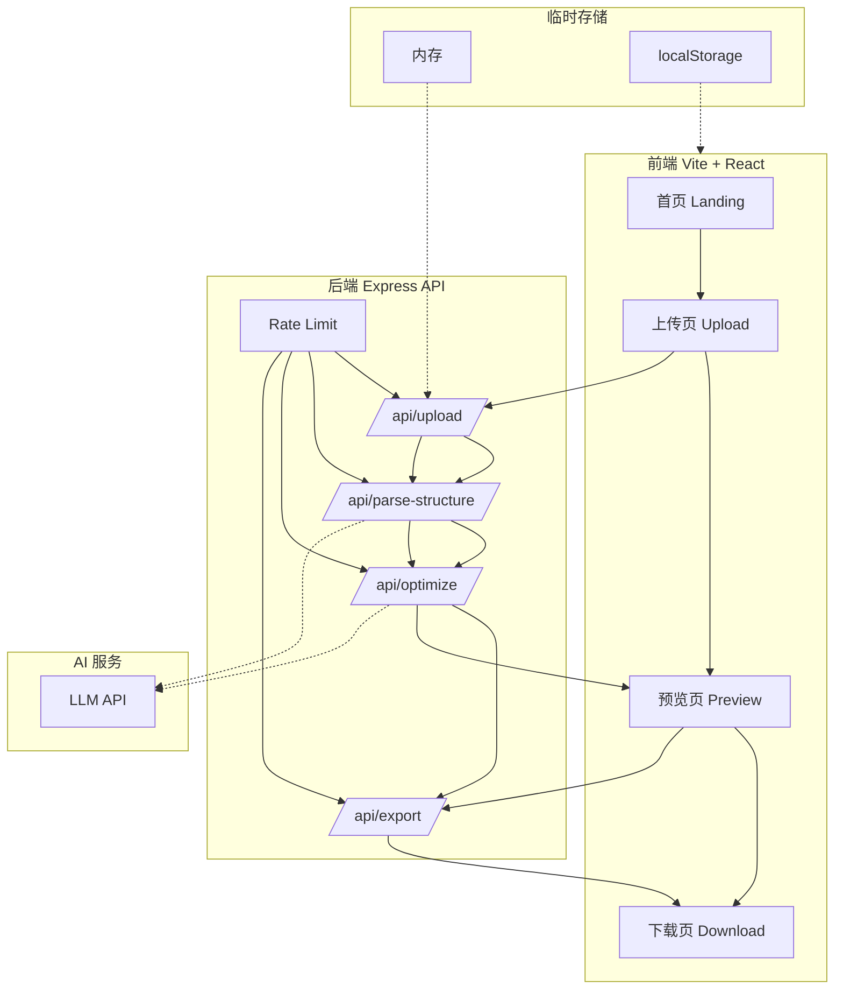

# AI 简历工具技术方案文档

## 1. 方案概述

### 1.1 项目定位
一款基于大语言模型的在线简历优化与生成工具。用户上传 PDF/Word 简历，填写目标岗位与优化需求，AI 自动完成简历内容结构化、岗位匹配优化、模板渲染，并导出 PDF/Word 文件。

### 1.2 核心目标
- 支持 PDF/Word 简历上传并提取文本
- 通过 LLM 将非结构化文本解析为标准化简历数据
- 基于目标岗位 JD 进行内容扩写/精简/改写
- 生成三种不同风格的高质量简历模板预览
- 支持一键导出 PDF/Word
- 数据不落库，保障用户隐私
- 7 天内完成 MVP 并具备扩展能力

## 2. 技术选型

### 2.1 前端

| 技术 | 版本 | 用途 |
|------|------|------|
| Vite | 5.x | 构建工具，启动快、热更新快 |
| React | 18.x | UI 框架 |
| TypeScript | 5.x | 类型安全 |
| Tailwind CSS | 3.4.17 | 原子化样式 |
| shadcn/ui | 最新 | 组件库基础 |
| Zustand | 4.x | 状态管理 + localStorage 持久化 |
| react-router-dom | 6.x | 路由 |
| lucide-react | 最新 | 图标 |
| react-icons | 最新 | 扩展图标 |
| framer-motion | 最新 | 动画效果（可选） |
| html2canvas + jsPDF | 最新 | 备用 PDF 导出方案 |

### 2.2 后端

| 技术 | 版本 | 用途 |
|------|------|------|
| Node.js | 20.x LTS | 运行时 |
| Express | 4.x | Web 框架 |
| TypeScript | 5.x | 类型安全 |
| pdf-parse | 最新 | PDF 文本提取 |
| mammoth.js | 最新 | Word 文本提取 |
| docx | 最新 | Word 导出 |
| @react-pdf/renderer | 最新 | 高质量 PDF 导出 |
| Zod | 3.x | 数据校验 |
| cors | 最新 | 跨域处理 |
| multer | 最新 | 文件上传 |
| dotenv | 最新 | 环境变量 |

### 2.3 AI 能力

| 能力 | 实现方式 |
|------|---------|
| 结构化解析 | 调用 LLM，要求输出 JSON |
| 内容优化 | 调用 LLM，注入岗位 JD 与用户需求 |
| 模型兼容 | 统一使用 OpenAI SDK 格式，支持 OpenAI / DeepSeek / Claude / 通义千问等兼容 OpenAI 接口的模型 |
| 超时与重试 | 30s 超时，失败重试 1 次，降级返回原结构 |

## 3. 系统架构



## 4. 架构分层说明

### 4.1 前端层
- 单页应用（SPA），4 个核心页面：首页、上传页、预览页、下载页
- 状态管理：Zustand + persist，缓存解析结果与优化结果
- 文件上传：通过前端直传到后端 `/api/upload`
- 模板预览：使用 React 组件渲染，HTML 模拟 A4 比例，CSS 打印样式保证导出效果

### 4.2 后端层
- 4 个核心 API 路由
- 无数据库，所有数据处理在内存中完成
- 上传文件通过 `multer` 接收，`buffer` 形式传给解析器，处理完立即释放
- 基于 IP 的内存限流，每 IP 每小时 10 次优化请求

### 4.3 AI 服务层
- 统一封装 LLM 客户端，支持多模型切换
- 通过环境变量配置 `AI_API_KEY`、`AI_BASE_URL`、`AI_MODEL`
- Prompt 工程分为：结构化解析 Prompt、内容优化 Prompt

## 5. 数据模型

### 5.1 Resume 标准结构

```typescript
export interface Resume {
  basicInfo: {
    name: string;
    title: string; // 期望岗位 / 当前职位
    email?: string;
    phone?: string;
    location?: string;
    website?: string;
    linkedin?: string;
    github?: string;
  };
  summary: string; // 自我评价 / 个人简介
  education: EducationItem[];
  experience: ExperienceItem[];
  projects: ProjectItem[];
  skills: string[];
  certifications?: CertificationItem[];
  languages?: LanguageItem[];
}

export interface ExperienceItem {
  company: string;
  position: string;
  startDate: string;
  endDate: string;
  location?: string;
  description: string[]; // 要点形式
}

export interface EducationItem {
  school: string;
  degree: string;
  field?: string;
  startDate: string;
  endDate: string;
}

export interface ProjectItem {
  name: string;
  role?: string;
  startDate?: string;
  endDate?: string;
  description: string[];
  link?: string;
}

export interface CertificationItem {
  name: string;
  issuer?: string;
  date?: string;
}

export interface LanguageItem {
  language: string;
  proficiency: string;
}
```

### 5.2 用户需求结构

```typescript
export interface OptimizeRequest {
  jobDescription: string; // 目标岗位 JD
  tone: 'professional' | 'calm' | 'active' | 'creative'; // 语气
  focus: Array<'achievements' | 'skills' | 'projects' | 'leadership'>; // 重点
  otherRequirements?: string;
  fileType: 'pdf' | 'docx';
}
```

## 6. API 设计

### 6.1 POST /api/upload

**功能**：接收 PDF/Word 文件，返回提取的纯文本

**请求**：
```http
POST /api/upload
Content-Type: multipart/form-data

file: <File>
```

**响应**：
```json
{
  "success": true,
  "data": {
    "text": "提取的简历文本...",
    "fileName": "resume.pdf",
    "fileType": "pdf"
  }
}
```

### 6.2 POST /api/parse-structure

**功能**：将非结构化文本解析为标准 Resume 结构

**请求**：
```json
{
  "text": "提取的简历文本..."
}
```

**响应**：
```json
{
  "success": true,
  "data": {
    "resume": { /* Resume 对象 */ }
  }
}
```

### 6.3 POST /api/optimize

**功能**：基于岗位 JD 优化简历内容

**请求**：
```json
{
  "resume": { /* Resume 对象 */ },
  "jobDescription": "目标岗位 JD...",
  "tone": "professional",
  "focus": ["achievements", "skills"],
  "otherRequirements": "希望突出管理经验"
}
```

**响应**：
```json
{
  "success": true,
  "data": {
    "optimizedResume": { /* 优化后的 Resume 对象 */ },
    "changes": ["将描述改为量化成果", "补充了技能关键词"]
  }
}
```

### 6.4 POST /api/export

**功能**：根据选中的模板风格导出 PDF/Word

**请求**：
```json
{
  "resume": { /* 优化后的 Resume 对象 */ },
  "template": "minimalist" | "tech" | "elegant",
  "format": "pdf" | "docx"
}
```

**响应**：
```http
Content-Type: application/pdf
Content-Disposition: attachment; filename="resume.pdf"
```

## 7. AI 流程设计

### 7.1 结构化解析 Prompt

**目标**：将非结构化文本转为标准 JSON Resume

```text
你是一名专业的简历解析专家。请从以下简历文本中提取关键信息，并严格按照 JSON 格式返回。

要求：
1. 字段必须完整，缺失字段用空字符串或空数组填充
2. 日期统一格式为 YYYY-MM 或 YYYY
3. 工作经历按时间倒序排列
4. 描述内容拆分为要点数组，每点不超过 2 行
5. 如果信息无法判断，不要编造，使用空值

输出 JSON 格式：
{
  "basicInfo": { "name": "", "title": "", "email": "", "phone": "", ... },
  "summary": "",
  "education": [...],
  "experience": [...],
  "projects": [...],
  "skills": [],
  ...
}

简历文本：
{{RESUME_TEXT}}
```

### 7.2 内容优化 Prompt

**目标**：基于岗位 JD 和用户需求优化简历

```text
你是一名资深简历优化专家，拥有 10 年 HR 与招聘经验。请根据用户提供的简历结构、目标岗位 JD 和优化需求，对简历进行专业化改写。

优化规则：
1. 如果某模块内容过少，进行合理扩写；如果内容过多，进行精简。
2. 优先使用目标岗位 JD 中的关键词，提升 ATS 匹配度。
3. 工作经历描述尽量量化成果，使用 STAR 或 PAR 结构。
4. 语气要求：{{TONE}}
5. 重点突出：{{FOCUS}}
6. 其他要求：{{OTHER_REQUIREMENTS}}

输出要求：
1. 严格返回 JSON 格式，结构与输入 Resume 一致
2. 不要添加输入中没有的虚假信息
3. 自我评价（summary）需要重新撰写，突出与岗位的匹配度

目标岗位 JD：
{{JOB_DESCRIPTION}}

输入简历：
{{RESUME_JSON}}
```

## 8. 安全设计

### 8.1 数据安全
- 上传文件仅存储于内存，不写入磁盘，不进入数据库
- 处理完成后立即释放内存中的文件 buffer
- 优化后的 Resume 数据可缓存于 localStorage，但**不含原始文件**
- 接口返回中不暴露任何原始文件路径

### 8.2 API 安全
- API Key 仅配置于后端环境变量，前端不暴露
- 基于 IP 的内存限流：每 IP 每小时 10 次优化请求
- 上传文件大小限制：10MB
- 文件类型白名单：`.pdf`, `.doc`, `.docx`
- 所有请求增加基础日志（不包含敏感内容）

### 8.3 部署安全
- 生产环境使用 HTTPS
- 环境变量不提交到代码仓库
- 提供 `.env.example` 模板

## 9. 性能与可靠性

### 9.1 AI 调用
- 超时：30 秒
- 重试：失败时重试 1 次
- 降级：连续失败时返回原始结构，并提示用户检查输入或稍后重试

### 9.2 文件处理
- 解析器使用 stream/buffer 方式，避免大文件 OOM
- PDF 解析限制页数，建议 5 页以内简历

### 9.3 前端性能
- 路由懒加载
- 模板组件按需渲染
- 动画使用 CSS 优先，避免重排

## 10. 部署方案

### 10.1 推荐部署方式
- 前端：Vercel / Netlify / Cloudflare Pages（静态托管）
- 后端：Railway / Render / Fly.io / 自有服务器

### 10.2 开发环境
```bash
# 前端
npm create vite@5 ai-resume-web -- --template react-ts
cd ai-resume-web
npm install

# 后端
mkdir ai-resume-api
cd ai-resume-api
npm init -y
npm install express cors multer pdf-parse mammoth docx @react-pdf/renderer zod dotenv
npm install -D typescript @types/express @types/multer @types/cors @types/node ts-node nodemon
```

### 10.3 环境变量

前端 `.env`：
```env
VITE_API_BASE_URL=http://localhost:3001/api
```

后端 `.env`：
```env
PORT=3001
AI_API_KEY=your_api_key
AI_BASE_URL=https://api.openai.com/v1
AI_MODEL=gpt-4o-mini
ALLOWED_ORIGINS=http://localhost:5173
RATE_LIMIT_MAX=10
RATE_LIMIT_WINDOW_MS=3600000
```

## 11. 目录结构

```
ai-resume/
├── web/                          # 前端 Vite + React
│   ├── src/
│   │   ├── components/
│   │   │   ├── ui/               # shadcn/ui 组件
│   │   │   ├── resume/
│   │   │   │   ├── MinimalistTemplate.tsx
│   │   │   │   ├── TechTemplate.tsx
│   │   │   │   └── ElegantTemplate.tsx
│   │   │   ├── upload/
│   │   │   ├── preview/
│   │   │   └── download/
│   │   ├── pages/
│   │   │   ├── Home.tsx
│   │   │   ├── Upload.tsx
│   │   │   ├── Preview.tsx
│   │   │   └── Download.tsx
│   │   ├── lib/
│   │   │   ├── api.ts            # API 调用封装
│   │   │   └── store.ts          # Zustand store
│   │   ├── types/
│   │   │   └── resume.ts
│   │   ├── App.tsx
│   │   ├── main.tsx
│   │   └── index.css
│   ├── index.html
│   ├── package.json
│   ├── vite.config.ts
│   ├── tailwind.config.js
│   └── tsconfig.json
├── api/                          # 后端 Express
│   ├── src/
│   │   ├── routes/
│   │   │   ├── upload.ts
│   │   │   ├── parse-structure.ts
│   │   │   ├── optimize.ts
│   │   │   └── export.ts
│   │   ├── services/
│   │   │   ├── ai.ts             # LLM 客户端封装
│   │   │   ├── parser.ts         # PDF/Word 解析
│   │   │   └── export.ts         # PDF/Word 导出
│   │   ├── prompts/
│   │   │   ├── parse.ts
│   │   │   └── optimize.ts
│   │   ├── schemas/
│   │   │   └── resume.ts
│   │   ├── middleware/
│   │   │   ├── rate-limit.ts
│   │   │   └── error-handler.ts
│   │   ├── types/
│   │   │   └── resume.ts
│   │   └── index.ts
│   ├── package.json
│   ├── tsconfig.json
│   └── .env.example
├── docs/
│   ├── design.md                 # 设计文档
│   └── architecture.md           # 本技术方案文档
└── README.md
```

## 12. 风险与应对

| 风险 | 影响 | 应对策略 |
|------|------|---------|
| LLM 解析不稳定 | 输出 JSON 格式错误 | Zod 校验 + 失败重试 + 降级 |
| PDF 解析失败 | 无法提取文本 | 提示用户手动输入或检查文件 |
| AI 成本过高 | 运营压力 | 限流 + 选择便宜模型（如 gpt-4o-mini / DeepSeek-V3） |
| 模板渲染差异 | 预览与导出效果不一致 | 统一使用 React 组件 + 打印样式测试 |
| 浏览器兼容性 | 导出异常 | 优先测试 Chrome/Firefox/Edge |
| 用户隐私顾虑 | 转化率下降 | 上传页明确隐私声明 + 数据不落库 |

## 13. 扩展性规划

### 13.1 短期（MVP 后 1-2 月）
- 增加用户账号系统，保存历史简历
- 增加更多模板风格（商务、创意、学术）
- 支持多语言简历（中英双语）

### 13.2 中期（3-6 月）
- 接入支付，实现订阅制 / 按次付费
- 增加简历评分与建议功能
- 支持从 LinkedIn 导入

### 13.3 长期（6 月以上）
- 模板市场，允许用户自定义模板
- 简历数据分析，优化建议基于大数据
- 移动端 App

## 14. 技术栈最终清单

| 层级 | 技术 |
|------|------|
| 前端框架 | Vite 5 + React 18 + TypeScript 5 |
| 样式 | Tailwind CSS 3.4.17 + shadcn/ui |
| 状态管理 | Zustand + persist |
| 路由 | react-router-dom 6 |
| 后端框架 | Express 4 + TypeScript 5 |
| 文件解析 | pdf-parse + mammoth.js |
| PDF 导出 | @react-pdf/renderer |
| Word 导出 | docx |
| AI 接口 | OpenAI SDK 兼容接口 |
| 校验 | Zod |
| 部署 | 前端静态托管 + 后端 Node 服务 |

---

*本文档为 AI 简历工具的整体技术架构方案，后续开发以本文档和 `design.md` 为依据。*
