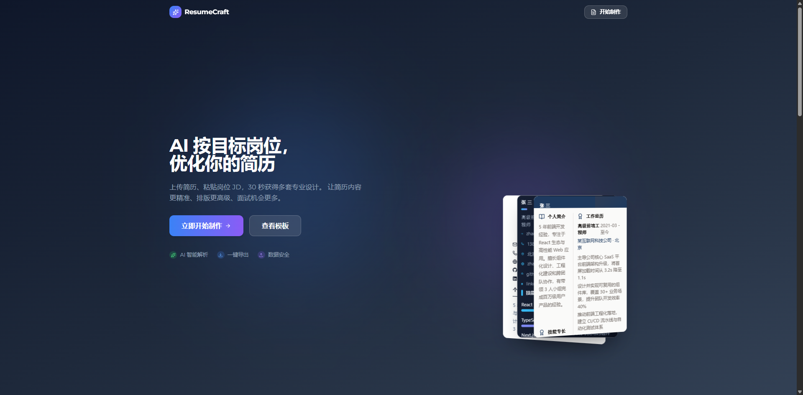
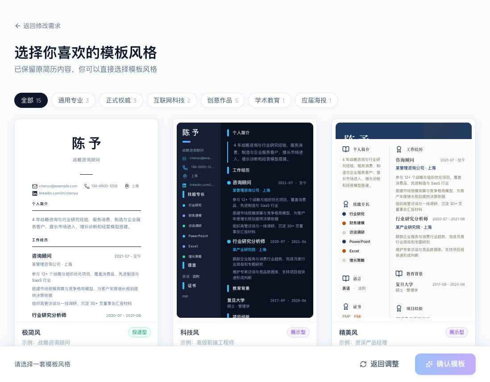
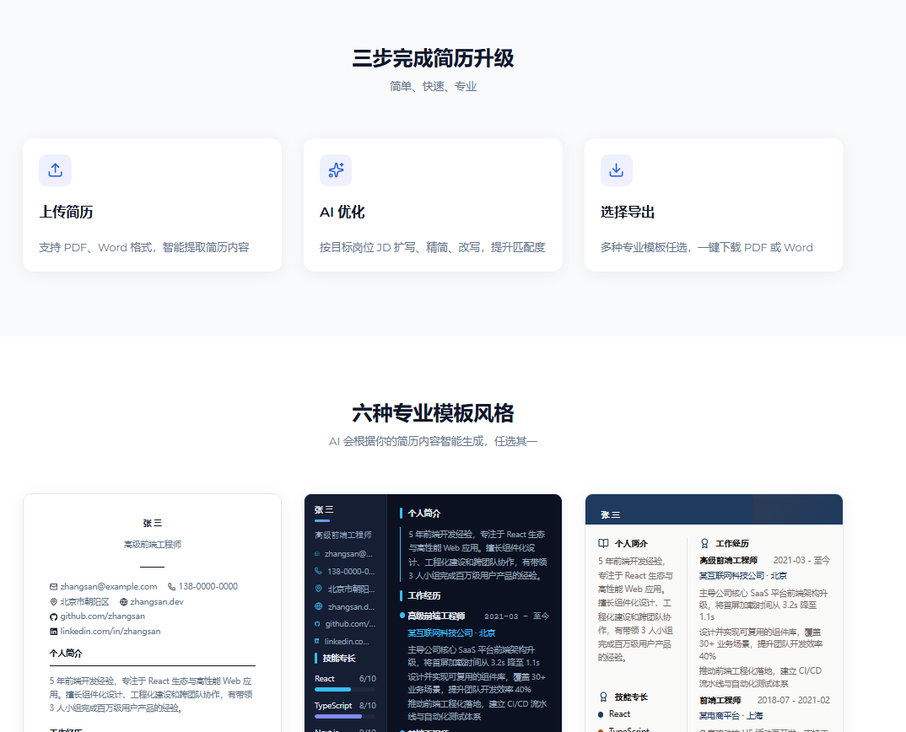
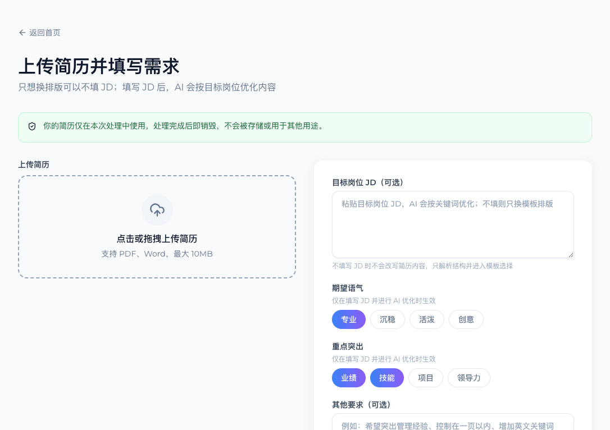

# ResumeCraft

一个面向中文简历场景的 AI 简历排版与优化工具。用户可以上传 PDF / Word 简历，直接换成专业模板导出；如果有目标岗位 JD，也可以让 AI 先做结构化解析、关键词匹配与内容改写，再选择模板生成 PDF 或 Word。



访问地址：https://resume.dolfi.chat

## 功能特性

- **两种制作方式**：不填 JD 时只解析结构并换排版；填写 JD 后再按岗位关键词优化内容。
- **文件解析**：支持 PDF、DOC、DOCX，单文件最大 10MB。
- **AI 结构化**：把非结构化简历文本转换为统一 Resume 数据结构。
- **岗位优化**：根据目标岗位 JD、语气和突出重点改写简历内容，并生成 ATS 关键词匹配报告。
- **模板库**：内置 15 套职业场景模板，覆盖通用专业、正式权威、互联网科技、创意作品、学术教育、应届海投等分类。
- **多页流程**：首页、上传、模板预览、下载、模板库和 AI 优化介绍页使用独立路由，支持刷新、返回和直接分享链接。
- **SEO 基础能力**：公开页面配置独立标题、描述、Canonical、Open Graph、结构化数据、`robots.txt` 和 `sitemap.xml`。
- **导出能力**：支持 PDF 和 Word 导出；PDF 由后端 Puppeteer 渲染，保留可选中文本和打印分页。
- **隐私友好**：不依赖数据库，上传文件在内存中处理，解析后立即释放文件 buffer。
- **生产配置**：支持 CORS 白名单、IP 限流、AI 模型分任务配置和 Docker 部署。

## 界面预览

| 首页 | 模板选择 |
|------|----------|
|  |  |

| 模板展示 | 上传简历 |
|----------|----------|
|  |  |

## 技术栈

### 前端

- Vite 5
- React 18
- TypeScript 5
- Tailwind CSS
- shadcn/ui 风格组件
- Zustand
- Framer Motion

### 后端

- Node.js 20
- Express 4
- TypeScript
- OpenAI SDK 兼容接口
- pdf-parse
- mammoth
- docx
- Puppeteer
- Zod
- Multer

## 项目结构

```text
ai-resume/
├── api/                    # Express API 服务
│   ├── src/
│   │   ├── routes/         # upload / parse / optimize / export
│   │   ├── services/       # AI、解析、导出、PDF 渲染
│   │   ├── middleware/     # 限流、错误处理
│   │   └── schemas/        # Zod 请求校验
│   └── Dockerfile
├── web/                    # Vite + React 前端
│   └── src/
│       ├── pages/          # 首页、上传、预览、下载、模板库、AI 优化页
│       ├── components/     # UI 与简历模板组件
│       └── lib/            # API、状态、模板配置
├── shared/                 # 前后端共享模板 token
├── files/                  # README 截图
├── docs/                   # 方案与模板规划文档
├── architecture.md
├── design.md
├── LICENSE
└── readme.md
```

## 本地运行

### 1. 准备环境

- Node.js 20+
- npm
- 一个 OpenAI SDK 兼容的模型服务 Key

### 2. 启动后端

```bash
cd api
npm install
cp .env.example .env
npm run dev
```

后端默认运行在 `http://localhost:3001`。

### 3. 启动前端

```bash
cd web
npm install
cp .env.example .env
npm run dev
```

前端默认运行在 `http://localhost:5173`，如端口被占用，Vite 会自动切换到可用端口。

## 环境变量

### 前端 `web/.env`

```env
VITE_API_BASE_URL=http://localhost:3001/api

# 生产域名，用于 canonical、OG URL、robots.txt 和 sitemap.xml
VITE_SITE_URL=https://resume.dolfi.chat
```

### 后端 `api/.env`

```env
PORT=3001
NODE_ENV=development

AI_API_KEY=your_api_key
AI_BASE_URL=https://api.openai.com/v1
AI_MODEL=gpt-4o-mini

# 可选：解析和优化分别使用不同模型
# AI_PARSE_MODEL=gpt-4o-mini
# AI_OPTIMIZE_MODEL=gpt-4o

# 可选：生成上限与超时
AI_MAX_TOKENS=4096
AI_TIMEOUT_MS=60000

# 生产环境必须配置准确来源，多个来源用逗号分隔
ALLOWED_ORIGINS=http://localhost:5173

# AI 相关接口限流
RATE_LIMIT_MAX=10
RATE_LIMIT_WINDOW_MS=3600000
```

## 核心流程

### 页面路由

| 路径 | 说明 | SEO 策略 |
|------|------|----------|
| `/` | 首页与产品入口 | 可索引 |
| `/templates` | 公开简历模板库 | 可索引 |
| `/ai-resume-optimizer` | AI 简历优化介绍页 | 可索引 |
| `/upload` | 上传简历与填写 JD | `noindex` |
| `/preview` | 模板预览与选择 | `noindex` |
| `/download` | 导出 PDF / Word | `noindex` |

### 只换排版

1. 上传 PDF / Word 简历。
2. 后端提取文本。
3. AI 将简历文本解析为结构化 Resume 数据。
4. 前端进入模板选择页。
5. 用户选择模板并导出 PDF / Word。

### 按岗位优化

1. 上传 PDF / Word 简历。
2. 粘贴目标岗位 JD，选择语气、突出重点和其他要求。
3. AI 解析简历结构。
4. AI 根据 JD 改写内容，并返回 ATS 匹配报告。
5. 用户选择模板并导出 PDF / Word。

## API 概览

| 方法 | 路径 | 说明 |
|------|------|------|
| `GET` | `/api/health` | 健康检查 |
| `POST` | `/api/upload` | 上传 PDF / Word 并提取文本 |
| `POST` | `/api/parse-structure` | 将文本解析为结构化简历 |
| `POST` | `/api/optimize` | 非流式岗位优化 |
| `POST` | `/api/optimize/stream` | SSE 流式岗位优化 |
| `POST` | `/api/export` | 导出 PDF / Word |

## 构建与检查

```bash
# 前端构建
cd web
npm run build

# 使用正式域名生成 sitemap.xml 和 robots.txt
VITE_SITE_URL=https://resume.dolfi.chat npm run seo:sitemap

# 后端构建
cd ../api
npm run build
```

前端构建会在配置 `VITE_SITE_URL` 或 `SITE_URL` 时自动生成 `public/sitemap.xml` 和带 Sitemap 地址的 `public/robots.txt`；未配置域名时会跳过生成，避免写入错误的生产 URL。

## 部署建议

这个项目的后端包含文件上传、Puppeteer PDF 渲染和较长的 AI 请求，推荐使用容器服务承载后端，而不是把后端拆成普通短时函数。

### 推荐方案

- **国内 MVP / 小规模上线**：CloudBase 静态托管 + CloudBase Run
- **国内正式生产**：CloudBase Run 或腾讯云 CVM / TKE，后端建议至少 1C/2G
- **海外部署**：前端 Vercel / Cloudflare Pages，后端 Google Cloud Run / Render / Railway
- **预算优先**：轻量云服务器 + Docker Compose + Nginx

### 当前 CloudBase 配置参考

| 资源 | 值 |
|------|----|
| 环境 ID | `ai-native-d8ghthch055daacb6` |
| 区域 | `ap-shanghai` |
| CloudRun 服务 | `ai-resume-api` |
| 后端模式 | Docker 容器 |

生产部署时需要设置后端环境变量，尤其是 `AI_API_KEY`、`AI_BASE_URL`、`AI_MODEL` 和 `ALLOWED_ORIGINS`。

前端生产部署时建议同时设置 `VITE_API_BASE_URL` 和 `VITE_SITE_URL`。如果静态托管平台不自动回退到 `index.html`，需要配置 SPA fallback，确保 `/templates`、`/ai-resume-optimizer`、`/upload` 等多页路径刷新时仍返回前端入口。

## 隐私与安全

- 项目默认不接入数据库。
- 上传文件通过内存处理，解析后释放 buffer。
- 生产环境必须配置 `NODE_ENV=production` 和准确的 `ALLOWED_ORIGINS`。
- AI 接口有基于 IP 的内存限流，可通过 `RATE_LIMIT_MAX` 和 `RATE_LIMIT_WINDOW_MS` 调整。
- 不要把 `.env`、API Key 或用户简历文件提交到仓库。

## 文档

- [architecture.md](architecture.md)：系统架构、数据模型、API 设计和部署方案
- [design.md](design.md)：产品定位、视觉规范和页面设计
- [docs/template-expansion-plan.md](docs/template-expansion-plan.md)：模板扩展规划
- [docs/resume-template-product-roadmap.md](docs/resume-template-product-roadmap.md)：简历模板产品路线
- [docs/review-templates-and-ai.md](docs/review-templates-and-ai.md)：模板与 AI 流程复盘

## 许可证

本项目基于 [MIT License](LICENSE) 开源。
